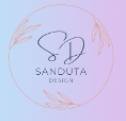
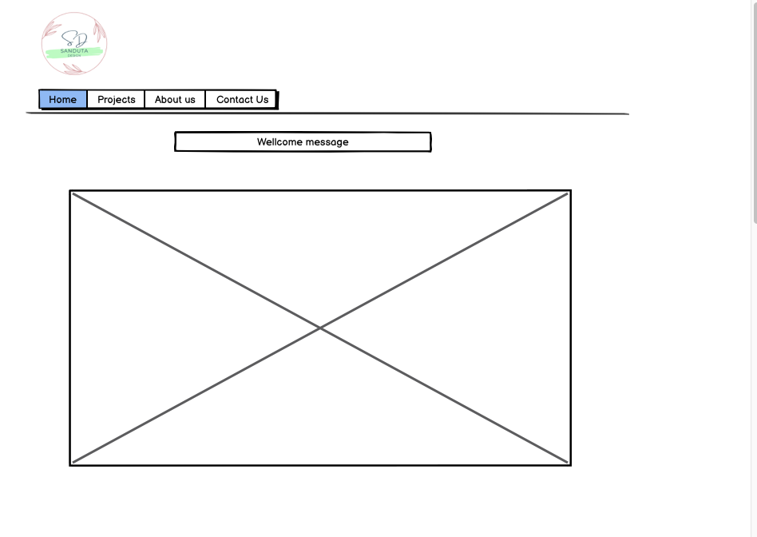
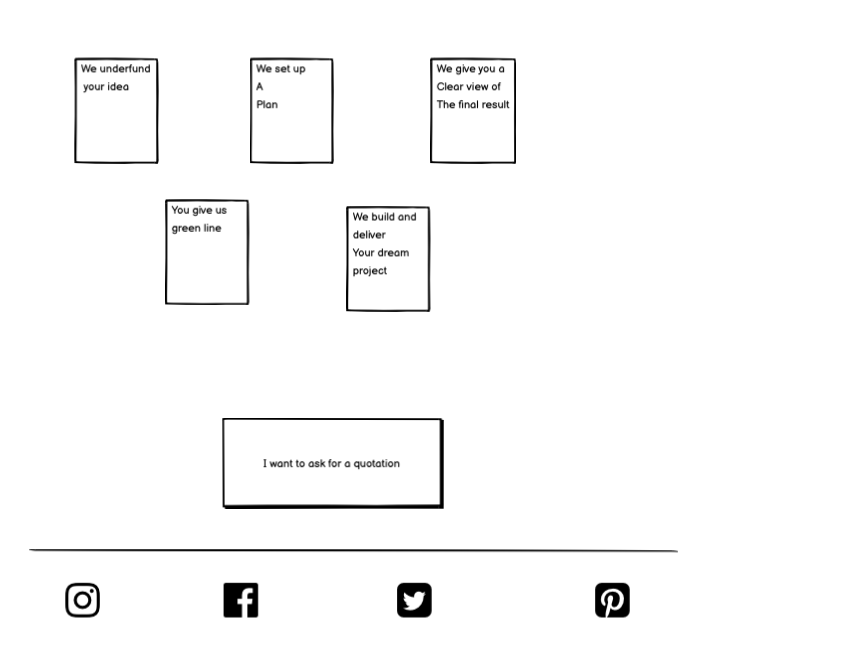
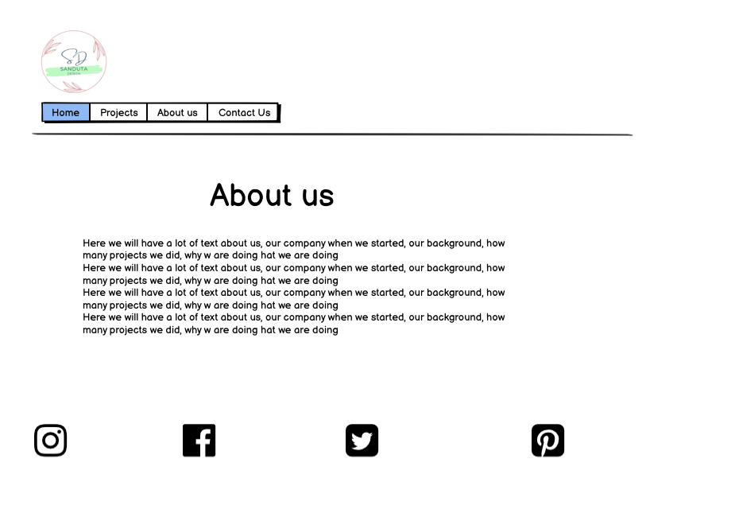
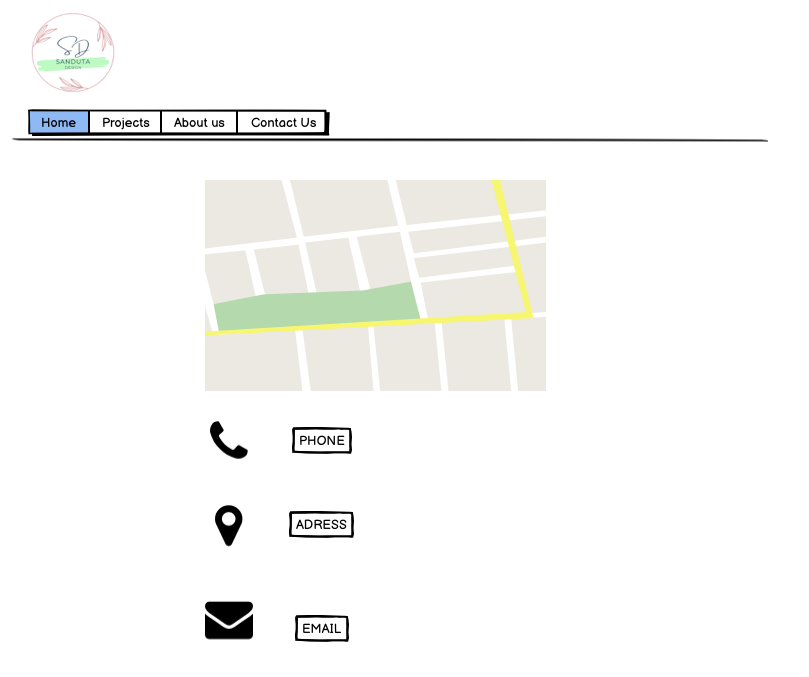
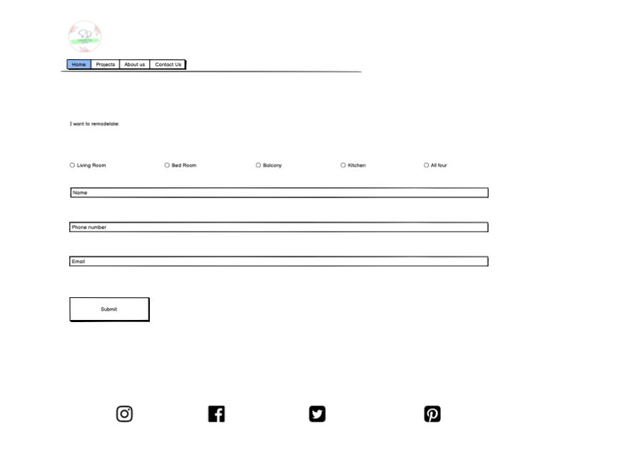
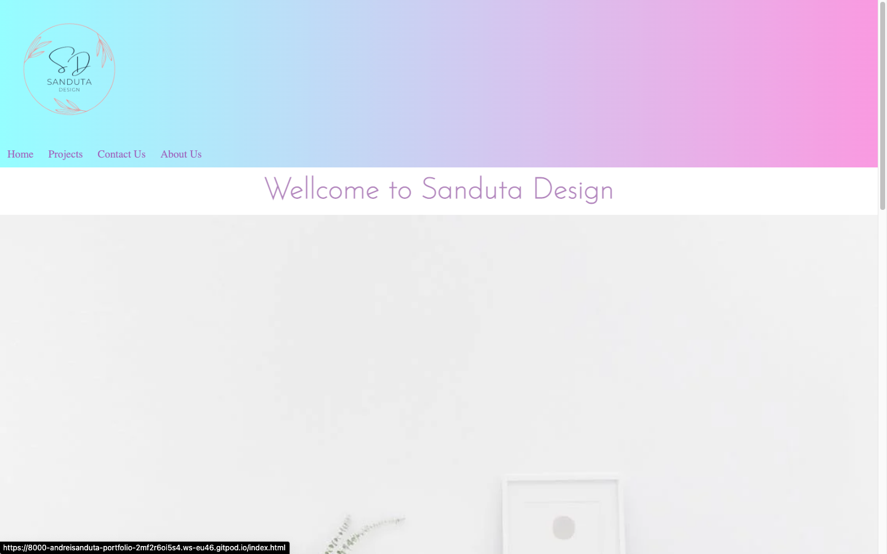
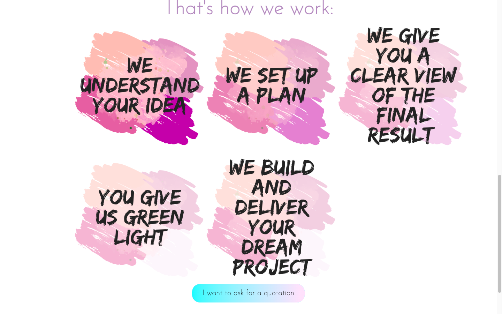
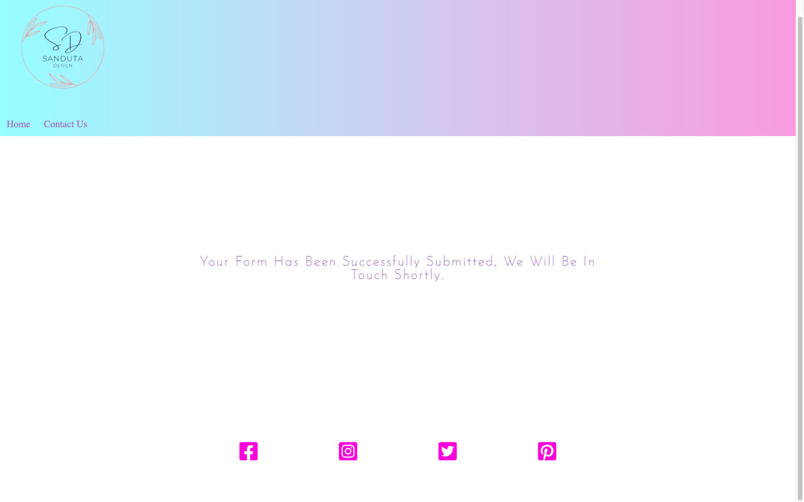

/workspace/portfolio/docs/logo.png
# **Sanduta design**

#### The intention of this website is to represent an interior design company in Stockholm. The objective of the project is to reach a larger audience to meet their remodeling dreams and expectations either for a specific room or for the entire house. While searching for interior designg,  the website sandutadesgin.com should be found right in the first lines of research.

# **What a visitor will find on the website?**

### On the site sandutadesign.com, the visitor must understand in a fraction of a second what the website is about and 
### what he can find on it.
* ### A very clean and appealing design
* ### A main menu that must contain
1. #### A logo.
2. #### A navigation bar.
    #### On the navigation bar it should be shown the four navigation tabs which are: "Home, Projects, Contact Us, About us"
3. #### A clean background image.
4. #### Ask for a quotation.
    #### This button should open a form where the user is able to fill in his/her personal information. The goal is to be contacted later on by the right team (based on the selected design), start the plan and send a quotation.
    * #### the form should have a submit button and all the fields are mandatory.
    * #### If all fields ares properly filled in, when the form is submitted the user will see a  confirmation message.
5. #### Process development milestones
6. #### Responsive social media links.
7. #### The Project Tab is a gallery containing some projects from Sanduta Design.
8. #### On The contact us Tab, the user should find the company’s information such as: email, phone number, address and a map should be displayed as well.
9. #### On the about us tab the user should be able to read the company background and mission.
# 
# **Future Features** 
* ####  Increase awareness of the webpage visitors (Banners with discount and limited offers).
* #### Build an FAQ page.
* #### Allow the customers to have an account.
#
# **Typography and colour scheme**
### On this project the Fonts used are the following ones
* #### font-family: Josefin Sans, sans-serif
* #### color: #9478c0;
* #### background colour is white
## Here you can see the wireframe pictures.  

#
#
## How the website looks like after finalised.

## This is a sketch of the main website. Some pictures, font family and colours might change to give to it a more harmonised look and a better appealing design.
# The technology used is  HTML and CSS
# Credits: This project was developed based on these websites:
* ##### https://stackoverflow.com/questions
* ##### https://validator.w3.org/
* ##### And Research on SLACK community.