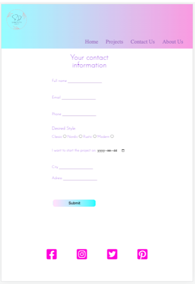
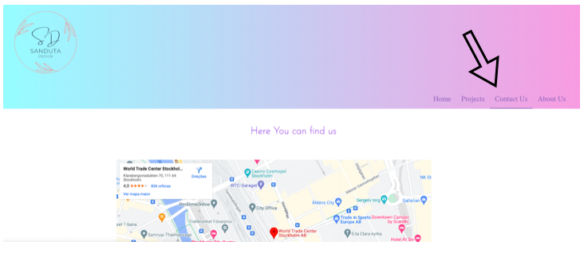

# **Sanduta design** 

 
 
The website for a company that does interior Design is what Sanduta design aims to be.  
was developed with the goal of making this business name a solid reputation in Stockholm.  
When someone decides to renovate a room or another area, "Sanduta design" should always  
appear among the top search results on Google, for instance. Some of the most talented and  
knowledgeable architects and designers are employed by this website, and they are passionate  
about what they do. The joy on the faces of those who choose to use Sanduta Design's services  
is their highest reward.

#

## **Features:**
 

**The landing page**  
 has a picture with a modern, clean look that gives the user an idea of  
what to anticipate from this website. A lovely, peaceful sensation is maintained when  
exploring the pages thanks to the design, that is fairly simple and minimalist.  
 

 

**"That’s how we work" section:**
 
This section enables the user to better understand the sequential events from the initial contact  
with Sanduta Design services through the project delivery.
 
 

**Ask a Quotation:**

When pressed, this button displays a form where the user may enter contact information and choose which  
room or rooms to pretend to renovate.

**The footer** 

This website has a footer area with connections to the necessary social networking platforms. The links  
will open in a new tab for the user's convenience. It encourages social engagement and aids in maintaining  
online connectivity for the user.

**Gallery**

The gallery's images were picked to demonstrate the high caliber of the final products and to provide  
inspiration for users who would like to make changes in their houses but are unsure of what they should do.

**The Form page**

By completing this form, the user may give some important information that will enable the customer service  
team to contact them quickly and deliver a tailored response.

**Confirmation message**

The user will get a confirmation message after submitting the form. The user must complete this step.  
The user may be certain that their interaction with the form was successful after obtaining this message.

**Contact us Page**

The user may simply discover all the contact information for the company "Sanduta Design" on the contact us page.  
The consumer may choose to phone, write an email, or even visit the office and speak with the architects in person,  
which will encourage them to make a decision. Having all this information available is quite helpful.  

**About us**

This part tries to familiarize the user with the business by providing them with information on the background  
of the business and how everything runs.

## **Testing**

Coding Checks:

* When clicked, the "get a quotation" button did not bring up the form.

By placing the button within a "div" along with the form, I was able to remedy that.

* The submit button wasn't connected to the submit message.

I used "data-href" to fix that.

**User experience evaluation:**

* The main page is connected to the logo button. The landing page should always be  
reached after clicking the logo button. We may verify that it is functioning by clicking on it.

* When the mouse is over the text like in the figure below, the primary menu buttons should be  
underlined. The user may now anticipate which page they will click on next thanks to that functionality.

* Ask a quotation button has a sliding effect. The button slides slightly up and to the left and  
changes color from a brighter gradient to a darker gradient when the mouse is hovered over it. I've tested it,  
and I can confirm that the button changes color and moves as it should.

* Buttons in the footer, when the mouse hovers over the social media icons, they should be vanished. 

* The respective social networking sites, including Facebook, Instagram, Twitter, and Pinterest,  
are connected to the symbols. As seen in the illustration below, clicking the icons should open  
the social network links in a new tab.

* Form:
When a user attempts to submit a form that is either incomplete or contains incorrect data, the  
form cannot be submitted, and notifications should be displayed to help the user understand what needs  
to be rectified before the form can be completed.
The picture shows that it's functioning as it should. The form cannot be submitted if  
the email field does not contain the "@" sign.

* All The fields must be filled out. If the fields are not filled out, the form cannot be  
submitted, and when the user tries to submit it, a notice asking them to  
"Please fill in this field" will appear.

* The project's start date is the same, as can be seen in the figure below.  
The submission fails if the user tries to submit without choosing the project starting date,  
and users receive a message that the starting date field has to be filled in.

* A confirmation message will appear when you've tested every field and clicked the submit button,  
if every field has the right data entered in it. We can certify that it is functioning properly after testing.

* As a last check to ensure that all the buttons are functional and appropriately connected, I verified that  
they all led to the appropriate sites by clicking each main menu button individually. I was able to validate  
that everything was up to date by doing this.

#

## **Validator Testing**

* HTML
    No errors were returned when passing through the official W3C validator

* CSS No errors were found when passing through the official (Jigsaw) validator

**Unfixed Bugs:**
No unfixed bugs left.

## Deployment:

The site was deployed to GitHub pages. The steps to deploy are as follows:

1. In the GitHub repository, navigate to the Settings tab
2. From the source section drop-down menu, select the Main Branch.
3. Once the main branch has been selected, the page will be automatically refreshed with  
a detailed ribbon display to indicate the successful deployment.  
The live link can be found here - https://andreisanduta.github.io/portfolio/

## Content

The text and all the content is authorial written by: “https://github.com/AndreiSanduta"

## Media

The photos used on this project was interlay uploaded from pixels.com.  
A website with free to use photographs.

The logo was created by: "https://github.com/AndreiSanduta"

## Technologies used:  

* HTML 

* CSS

## Credits:
For the forms I used some examples from: 

https://www.w3schools.com/html/html_forms.asp

For the slide of the button when the mouse hoovers the button I have used this forum:

https://stackoverflow.com/questions

